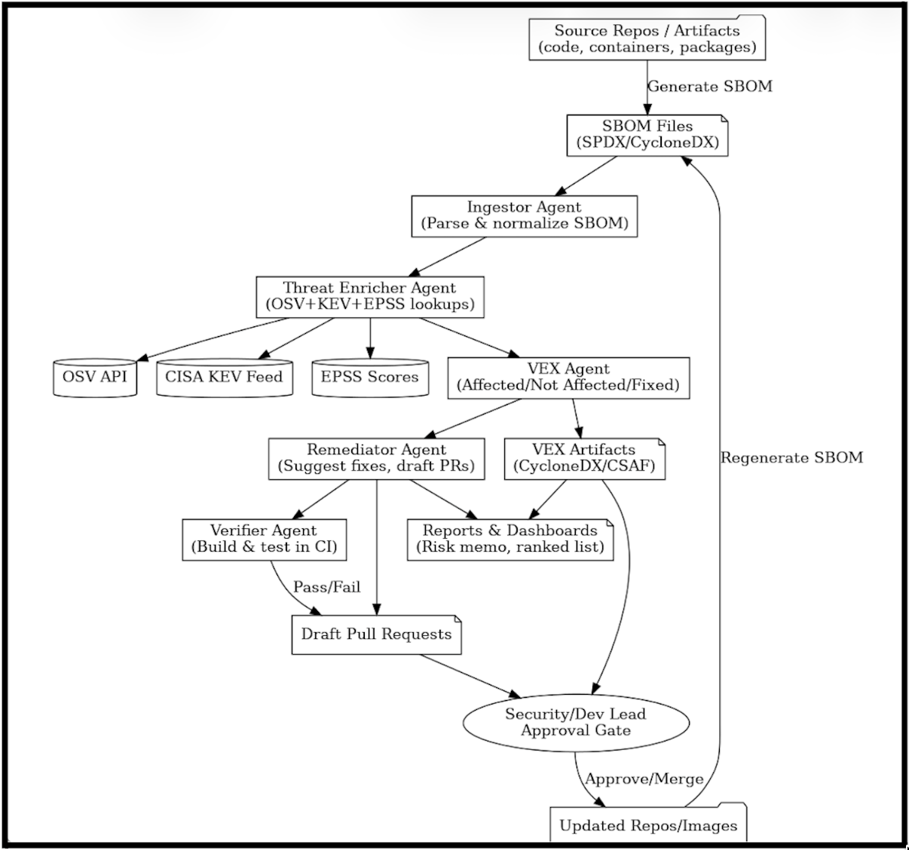

# 1) Change-Point-First RCA Agent for Microservices

Modern microservice systems generate **anomaly storms**: one real fault triggers dozens of alerts across downstream services. Teams spend precious minutes chasing **symptoms** instead of the **first cause**, inflating **MTTR** and burning **error budgets**.  
**This project** is an always-on, vendor-agnostic **AI observability agent** that detects the **earliest change** in system behavior, maps how it **propagates** through services, and delivers an **evidence-backed explanation** and **fix suggestions** — in real time.

---

## 🚩 Problem We’re Solving

- **Slow root-cause analysis (RCA)** in large microservice graphs.  
- **Alert fatigue** (duplication, flapping, symptom noise) hides the true origin.  
- **Static or opaque topologies** make it hard to see how faults spread after a deploy, schema migration, or feature-flag change.

**Consequence:** Engineers lose time pivoting between metrics, logs, and traces; incidents last longer than they should.

---

## ✅ How We Solve It (High Level)

### 1) Change-Point-First Detection
The agent continuously watches **golden KPIs** (latency, errors, saturation) and flags **where the first statistically significant shift occurred**.

### 2) Live Causal/Service Graph
From **distributed traces** and **change events** (deploys/flags/migrations), it maintains a live **“who-calls-whom”** graph with current dependencies.

### 3) Propagation Reasoning
It verifies that **downstream services** show issues **after** the first change, constructing a **cause → symptom** path.

### 4) Explainable Incident Card (Real Time)
Posts **one card** (Slack/PagerDuty) with:
- **Ranked suspects + confidence**
- **Timestamps**
- **Affected endpoints / SLO burn**
- **Related logs/traces**
- **What changed**
- **Recommended first fixes** (e.g., rollback last migration)

### 5) On-Demand Investigations
You can ask:  
> “analyze checkout timeouts last 30m”  
…and the agent reproduces the same **evidence-backed RCA**.

---

## 🧪 Example

```

10:06  inventory-db  write latency spikes   (earliest change)
10:07  inventory-svc slows
10:08  cart-api      times out
10:09  checkout      fails

```

**Agent card:**  
> *Earliest change at **inventory-db (10:06)** → propagated to **inventory-svc → cart-api → checkout**. Likely tied to migration **idx-2025-09-29**. Try **rollback** / **rebuild index**.*

---

## 📦 Project Goals (for this repo)

- Implement continuous **change-point detection** on golden KPIs.  
- Build and refresh a **live service graph** from traces + change events.  
- Correlate **earliest change** with **downstream symptoms** to propose a **propagation path**.  
- Emit an **explainable incident card** with evidence and suggested first actions.  
- Provide **Chat** entry points for **on-demand** investigations.

> This README describes the project concept and goals. See the `/docs` and `/examples` folders (to be added) for setup, datasets, and demos.

---

## 🛠️ High-Level Architecture (Planned)

```

[OTel Metrics/Logs/Traces]  [Change Events: deploys/flags/migrations]
\                    /
\                  /
[Ingest & Normalize]  <-------------------------------
|                                         |
[Service Graph Builder]  ←——— traces ————→  (keeps live map)
|
[Change-Point Detector]  (online, golden KPIs)
|
[Propagation & RCA Ranking]
|
[Incident Card Generator]
|
Slack / PagerDuty / Webhook API

```

---

## 📈 Why This Approach

Most tools group alerts or rely on static maps, which can elevate the **loudest symptom**.  
This agent **leads with time** (the **first** change) and validates a **propagation path** over a **live** dependency graph — producing faster, more trustworthy localization.

---


# 2)  MatchMeWith — AI-Powered Expert Matching for Organizations

An AI-powered expert matching system that connects you with the right professionals **inside** your company. MatchMeWith builds a **knowledge graph** and rich **people profiles** by leveraging data from docs, code, tickets, and org systems—so you can find true match in seconds.

---

## 🚀 What is this project?
MatchMeWith discovers, ranks, and introduces internal experts for a given topic, tech, domain, or system. It understands **skills**, **projects**, **ownership**, and **context** (teams, services, regions), then routes your request to the best-fit people.

---

## 🧩 The problem
- Org charts and job titles **don’t reflect real skills** or current work.
- Finding help is slow and noisy; people get **interrupted** repeatedly; **duplicate work** happens.

---

## 🤖 How the AI agent solves it
1. **Ingests signals** from company structure (titles/teams)/Git (repos/PRs)/tickets (Jira)/wikis(Confluence/Notion)/calendars (availability windows).
2. **Extracts skills & domains** using NLP (entity/skill mining, topic modeling) and links them to people/projects.
3. **Builds a knowledge graph** of *people ↔ skills ↔ projects ↔ systems* and a vector index for semantic search.
4. **Matches & ranks experts** by evidence (recent commits, tickets closed, docs authored), **context fit** (team/product), **availability**, and **responsiveness**.
5. **Introduces with context**: sends a brief to you and the expert (why they’re a match, top links, recent work) and collects feedback to improve future rankings.

---

## 🏗️ High-Level Architecture

```

```
    [company structure]   [Jira]   [Git]   [Docs/Wiki]   [Incidents]   [Calendars]
         \      |       |         |             |              /
                          [Ingest & ETL + PII Redaction]
                                       |
                       [Skill/Entity Extraction + Linking]
                                       |
                       [Knowledge Graph  + Vector Index]
                                       |
                       [Matching & Ranking Service (API)]
                                       |
                [AI Agent Orchestrator (Chat/Tool Use/RAG)]
                                       |
             Slack / Teams Bot • Web UI • Email/Calendar Invites
```

```


# 3) AI Agent that Converts SBOMs into Prioritized Remediation and VEX Reports

## 🚩 Background & Motivation

Modern enterprise software is built from thousands of third-party components. When vulnerabilities are discovered in those components, security teams struggle to know:
- Which vulnerabilities matter most right now?  
- Which actually affect our product in context?  
- How do we fix them quickly and document the fix?  

**Software Bill of Materials (SBOMs)** are machine-readable “ingredient lists” of all components in a product. Standards like **SPDX** and **CycloneDX** define how to generate them. But enterprises often end up with SBOMs as static lists without clear remediation actions.

Meanwhile, signals like:  
- **OSV** (Open Source Vulnerabilities database)  
- **CISA’s KEV** (Known Exploited Vulnerabilities) list  
- **EPSS** (Exploit Prediction Scoring System) probabilities  

provide powerful insight into which flaws are most urgent. **VEX** (Vulnerability Exploitability eXchange) formats let companies document if a vulnerability really affects them or not.

Despite all these standards, enterprises lack automation to connect **SBOM → Risk → Remediation**.  
That is the gap our project will address.

---

## 🚩 Problem Statement

Given an SBOM, enterprises need a system that can:  
- Detect which components have vulnerabilities.  
- Prioritize vulnerabilities by real-world exploitability (KEV, EPSS).  
- Decide whether the vulnerability actually affects the product (VEX reasoning).  
- Suggest or implement concrete remediation (e.g., dependency upgrade).  
- Produce an audit-ready report for managers and compliance teams.  

**Today this is mostly manual, noisy, and error-prone.**

---

## ✅ Project Objectives

We propose to build an **AI-Agent–based application** that will:  
- Ingest SBOMs (SPDX/CycloneDX).  
- Query vulnerability databases (OSV, KEV, EPSS).  
- Prioritize risks based on exploitation likelihood.  
- Generate VEX reports (affected / not affected / fixed).  
- Propose remediations (draft pull requests and risk memos).  

---

## 🛠️ Methodology

### Data Sources
- Open-source project SBOMs (generated with Syft or similar tools).  
- OSV API for vulnerabilities.  
- KEV (CISA published list).  
- EPSS scores (public dataset).  

### Agent Design
- **Planner**: Orchestrates lookups and decisions.  
- **Threat Enricher**: Annotates each SBOM component with vulnerabilities, KEV flags, EPSS scores.  
- **Contextualizer**: Produces VEX determinations.  
- **Remediator**: Suggests dependency updates or patches; drafts PRs + reports.  

### Evaluation
- Compare prioritization quality vs. CVSS-only baseline.  
- Measure how many suggested fixes compile/tests pass.  
- Evaluate VEX accuracy with human review.  


---

## 🛠️ High-Level Architecture




---

## 📦 Deliverables

- Prototype AI Agent that processes SBOMs and outputs ranked vulnerabilities, VEX statements, and suggested fixes.  
- Demo on several open-source projects.  
- Final Research Paper (academic style) detailing methods, results, evaluation, and limitations.  
- Presentation with live demonstration.  

---

## 📈 Expected Outcomes

- Demonstrate that AI agents can **reduce vulnerability noise** by highlighting the few flaws that really matter.  
- Show how **SBOM + KEV + EPSS + VEX** can be integrated end-to-end.  
- Provide a reproducible tool that could be extended for enterprise use.  
- Contribute an academic paper suitable for submission in applied AI/security venues.  

---

## 🧪 Example Situation

**Scenario:**  
Your team maintains a web application that depends on several open-source libraries. A new **SBOM** is generated after the latest build.

**SBOM snippet:**
- libraryA v2.4.1  
- libraryB v1.3.0  
- libraryC v4.0.2  

**Agent workflow:**
1. **Threat Enrichment**  
   - OSV lookup: libraryA v2.4.1 has CVE-2025-9999.  
   - KEV flag: CVE-2025-9999 is actively exploited in the wild.  
   - EPSS score: 0.74 (high likelihood of exploitation).  

2. **Contextual VEX Reasoning**  
   - The agent inspects usage of libraryA in your repo.  
   - Determines vulnerable function is used in production code.  
   - Emits a **VEX statement:** *Affected*.  

3. **Remediation**  
   - Finds that libraryA v2.4.5 contains the fix.  
   - Drafts a pull request upgrading libraryA from v2.4.1 → v2.4.5.  
   - Runs CI build/tests to confirm compatibility.  

4. **Reporting**  
   - Generates an executive risk memo:  
     > *“CVE-2025-9999 in libraryA is exploited in the wild (KEV) with high EPSS risk.  
     Upgrading to v2.4.5 removes exposure. Fix validated in CI.”*  
   - Updates audit trail with a VEX file showing the issue as **fixed**.  

**Outcome:**  
Instead of seeing dozens of CVE alerts, your team gets a **ranked vulnerability list, a validated PR, and an audit-ready VEX record** — cutting through noise and accelerating remediation.

---

4. # 🛡️ Data Privacy Guardian Agent

An **Agentic AI system** that autonomously monitors enterprise **data pipelines and databases** to detect, prevent, and remediate **PII leaks** or **non-compliant data flows** (e.g., exporting customer data without anonymization).  
Designed to help enterprises stay compliant with **GDPR, CCPA, HIPAA, PCI-DSS**, and other regulations.  

---

## 🚀 Problem

Enterprises process massive amounts of sensitive data (emails, SSNs, credit cards, health records).  
- **Developers and analysts** may unknowingly expose raw customer data.  
- Current compliance checks are **manual, slow, and reactive**.  
- Violations can lead to **multi-million-dollar fines** and reputational loss.  

---

## 💡 Solution

The **Data Privacy Guardian Agent**:  
- **Continuously monitors** data pipelines, queries, and exports.  
- **Detects sensitive PII/PHI** using ML + pattern detection.  
- Applies **policy-as-code** to enforce compliance.  
- Takes **autonomous actions**: mask, encrypt, block, or quarantine data.  
- Generates **audit-ready reports** for regulators and security teams.  

---

## 🏗️ Architecture


### **Core Components**
1. **Detection Layer** → Regex + ML (Presidio, spaCy, HuggingFace) for PII/PHI.  
2. **Classifier for Unstructured Data** → NLP/Embeddings to catch hidden PII in logs, notes, etc.  
3. **Policy Engine** → Compliance rules encoded with OPA/Sentinel.  
4. **Risk Scoring** → Context-aware severity based on lineage, destination, and user role.  
5. **Action Executor** → Applies masking, encryption, blocking, or quarantining.  
6. **Audit & Evidence Store** → Immutable logs + Data Protection Impact Assessment (DPIA) reports.  

### **Control Plane**
- **Admin Console** → Dashboards for monitoring and policy management.  
- **IAM & Secrets** → Role-based access + KMS/HSM integration.  
- **SIEM/SOAR** → Alerts via Splunk/ELK/Sentinel.  
- **Compliance Packs** → Mapped to GDPR, CCPA, HIPAA, PCI-DSS.  

---

## 🔄 Workflow Example

1. **Analyst runs an export query.**  
2. **Agent intercepts pipeline output.**  
3. **Detection layer finds PII** (e.g., emails, SSNs).  
4. **Policy engine checks compliance rules.**  
5. **Risk scoring decides** if masking/encryption is required.  
6. **Action executor applies transformations** or blocks.  
7. **Audit logs are generated and alerts sent** to SIEM.  

---

## ⚡ Benefits

- ✅ **Continuous Compliance** – Real-time enforcement of GDPR/CCPA.  
- ✅ **Reduced Risk** – Prevents PII leaks before they leave the system.  
- ✅ **Audit-Ready** – Auto-generates DPIA and compliance evidence.  
- ✅ **Cost Savings** – Avoids fines, reduces manual compliance work.  
- ✅ **Enterprise-Grade Security** – Works across DBs, data lakes, ML pipelines.  

---

## 📈 Roadmap

- [x] MVP: Detect emails + SSNs in SQL queries and block risky exports.  
- [ ] Add ML-based free-text PII detection.  
- [ ] Integrate with SIEM/SOAR platforms for automated alerts.  
- [ ] Full compliance reporting (GDPR DPIA, HIPAA audits).  
- [ ] Multi-agent collaboration (Privacy + Vulnerability agents).  


